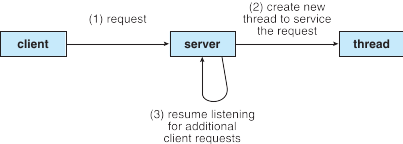
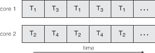
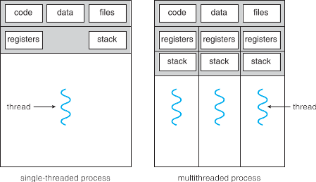

# Fire de execuție și memorie partajată [^osBook]

[^osBook]: [Operating Systems Concepts, 9th edition, by A. Silberschatz, P. B. Galvin, and G. Gagne](https://codex.cs.yale.edu/avi/os-book/OS9/index.html)


## Fire de execuție (threads)

- Majoritatea aplicațiilor moderne folosesc mai multe fire de execuție
- Părți diferite ale aplicației pot fi gestionate de fire de execuție diferite
  - actualizarea informațiilor pe ecran
  - încărcarea datelor de pe disc
  - verificarea ortografiei
  - procesarea cererilor venite din rețea
- Pot simplifica codul, pot oferi senzația de «responsiveness»


## Exemplu (Arhitectura unui server)



## Beneficii

- Responsiveness --- poate continua execuția și când parte a procesului e blocată
  - aspect crucial pentru intefețe utilizator
- Partajarea folosirii resurselor
- Scalabilitate --- în cazul arhitecturilor multi-procesor.

## Concurență vs. Paralelism

### Execuție concurentă pe un sistem single-core:


### Execuție concurentă în paralel pe un sistem multi-core:



## Aplicație non-concurentă vs. aplicație concurentă



## Memorie partajată

### Beneficii

- Eficiență: toate firele au access direct la memorie
- Model simplu: accesarea memoriei partajate se face la fel

### Probleme (Necesitatea sincronizării)
- Firele de execuție pot fi întrerupte oricând
  - de exemplu, în mijlocul unei operații importante
- Accesul concurent la date partajate poate genera inconsistență
- Menținerea consistenței datelor necesită mecanisme pentru a 
  asigura bunul comportament al proceselor cooperante

## Sincronizare -- Mutex (EXcludere MUTuală)

- Obiect special de sincronizare

- protejează o zonă de cod (sensibilă la modificări concurente)
- două zone protejate de același mutex nu se pot intrerupe una 
  pe alta


### Exemplu - mutex m


+-------------------+------------------+ 
|First Thread       | Second Thread    | 
+===================+==================+ 
|```                | ```              | 
|do stuff           | do stuff         | 
|synchronized(m):   | synchronized(m): | 
|   output results  |   output results | 
|do other stuff     | do other stuff   | 
|```                | ```              | 
+-------------------+------------------+ 


# Primitive pentru concurență în Java

## Fire de execuție (Threads)

Orice fir de execuție este instanță a clasei `Thread`{.java}

### Atributele unui thread

- __ID__: identificatorul thread-ului, unic pentru fiecare thread
    - este accesat cu `getId`{.java}, nu poate fi modificat
            
- __Name__: numele thread-ului (`String`{.java})
    - este accesat cu: `getName`{.java}, `setName`{.java}

- __Priority__: prioritatea thread-ului (un număr între 1 și 10)  
    - este accesată cu: `getPriority`{.java}, `setPriority`{.java}
    - în principiu thread-urile cu prioritate mai mare sunt executate primele
    - setarea priorității nu oferă garanții în privința execuției 

- __Status__: starea thread-ului
    - este accesat cu `getState`{.java}
    - nu poate fi modificat direct (e.g. nu există `setState`)

## [Starea thread-ului](https://docs.oracle.com/javase/7/docs/api/java/lang/Thread.State.html)

`public static enum Thread.State extends Enum<Thread.State>`{.java}

- __`NEW`__: încă nu a fost pornit
- __`RUNNABLE`__: în curs de execuție
- __`BLOCKED`__: blocat, așteptând achiziționarea unui lock
- __`WAITING`__: așteaptă (nedefinit de mult) un semnal de la un alt thread
- __`TIMED_WAITING`__: așteaptă (o perioadă determinată) un semnat de la un alt thread
- __`TERMINATED`__: după finalizarea execuției

Un thread poate fi într-o singură stare la un moment dat.

## Modalități de a crea obiecte de tip `Thread`{.java}

### Directă

- implementarea interfeței `Runable`{.java}
- ca subclasă a clasei `Thread`{.java}

### Abstractă

- folosind metodele clasei `Executors`{.java}

## Definirea unui thread folosind `Runnable`{.java}

### Standard
```java
public class HelloRunnable implements Runnable {
  public void run() { System.out.println("Hello thread!"); }
  public static void main(String args[]) {
     Thread t = new Thread (new HelloRunnable());
     t.start();
  } }
```

### Java 8 (funcții anonime)
```java
public class HelloTh {
  public static void main(String args[]) {
    new Thread ( () -> System.out.println("Hello thread!") )
        .start();
  } }
```

## Definirea unui thread ca subclasa a clasei `Thread`{.java}

```java
public class HelloThread extends Thread {

  public void run() {
    System.out.println("Hello thread!");
  }

  public static void main(String args[]) {
    new HelloThread().start();
  }
}
```

## Ciclul de viață al unui Thread

Sursa: [HowToDoInJava.com](https://howtodoinjava.com/java/multi-threading/java-thread-life-cycle-and-thread-states/)


## `public class Thread implements Runnable`{.java}

### Metode dinamice (se aplică unui obiect de tip `Thread`)

start()

: pornește thread-ul într-un fir de execuție separat și invocă run
          
run()

: este suprascrisă sau apelată din Runnable  

join(), join(long millisecunde)

: este invocată de thread-ul curent pe un al doilea thread; 
    thread-ul current este blocat până când al doilea thread iși termină execuția sau 
    până când expiră timpul

interrupt()

: întrerupe execuția thread-ului; 
    este folosit în situația în care un thread îi cere altui thread să își întrerupă execuția

boolean isAlive()

: întoarce true dacă thread-ul nu și-a încetat execuția


### Metode statice (se aplica thread-ului current)

yield()

: thread-ul cedează rândul altui thread

sleep(long milisecunde)

: thread-ul este blocat pentru perioada precizată

currentThread()
              
: întoarce o referință la thread-ul care invocă metoda

## Thread-uri în JVM (sursa: [docs.oracle.com](https://docs.oracle.com/javase/7/docs/api/java/lang/Thread.html))

Atunci când mașina virtuala Java pornește, de obicei există un singur thread
non-deamon[^1], care de obicei lansează în execuție metoda `main` a unei clase.

Mașina virtuală Java continuă să execute thread-uri până când:

- Este apelată metoda `exit` din clasa `Runtime` și managerul de securitate 
    permite terminarea execuției

- Toate thread-urile non-daemon s-au terminat
    - prin terminarea cu succes a execuției metodei `run`
    - printr-o excepție propagată dincolo de metoda `run`


[^1]: Thread-uri daemon: thread-uri cu prioritate mica, care au rolul de a servi thread-urile utilizator
(e.g. garbadge collector thread)

## `Thread.sleep()`{.java} și `InterruptedException`{.java}

`sleep()`  aruncă excepție dacă threadul este întrerupt de un alt thread în timp ce sleep este activă.

```java
public class SleepyMessages {
  public static void main(String args[])
      throws InterruptedException {
    String importantInfo[] = 
        { "This", "is", "very", "important"};

    for (int i = 0;  i < importantInfo.length; i++) {
      Thread.sleep(4000);//Pause for 4 seconds
      System.out.println(importantInfo[i]);
    }
  }
}
```

## `sleep` cu tratarea excepției `InterruptedException`

```java
public class MessageLoop implements Runnable {
  public void run() {
    String importantInfo[] =
        {"This", "is", "very", "important"};
    try {
      for (int i = 0; i < importantInfo.length; i++) {
        Thread.sleep(4000);//Pause for 4 seconds
        threadMessage(importantInfo[i]);
      }
    } catch (InterruptedException e) {
      threadMessage("I wasn't done!");
    }
  }
```

## `currentThread`, `getName`

```java
  public static void threadMessage(String message) {
    String threadName = Thread.currentThread().getName();
    System.out.format("%s: %s%n", threadName, message);
  }

  public static void main(String args[])
      throws InterruptedException {
    threadMessage("Starting MessageLoop thread");
    Thread t = new Thread(new MessageLoop());
    t.start();
    threadMessage("Waiting for MessageLoop thread to finish");
    t.join();
    threadMessage("Finally!");
  }
}
```

## `isAlive`, `join` cu expirare și `interrupt`

```java
public class MessageLoopInterrupted {
  public static void main(String args[])
      throws InterruptedException {
    long patience = 1000 * 10;
    long startTime = System.currentTimeMillis();
    threadMessage("Starting MessageLoop thread");
    Thread t = new Thread(new MessageLoop()); t.start();
    threadMessage("Waiting for MessageLoop thread to finish");
    while (t.isAlive()) {
      threadMessage("Still waiting..."); t.join(2000);
      if ((System.currentTimeMillis() - startTime
           > patience)  && t.isAlive()) {
        MessageLoop.threadMessage("Tired of waiting!");
        t.interrupt(); t.join();
      } }
    MessageLoop.threadMessage("Finally!"); } }
```

## Rulare `MessageLoopInterrupted`

```
main: Starting MessageLoop thread
main: Waiting for MessageLoop thread to finish
main: Still waiting...
main: Still waiting...
Thread-0: This
main: Still waiting...
main: Still waiting...
Thread-0: is
main: Still waiting...
main: Tired of waiting!
Thread-0: I wasn't done!
main: Finally!
```

## `ThreadLocal`{.java}: variabile locale thread-ului

```java
public class ThreadLocalId implements Runnable {
    private ThreadLocal<Long> threadLocal = new ThreadLocal<>();

    public void run() {
      threadLocal.set(Thread.currentThread().getId());
      System.out.format("Name: %s Id: %d%n",
          Thread.currentThread().getName(), threadLocal.get());
    }

  public static void main(String[] args) throws InterruptedException {
    ThreadLocalId sharedRunnable = new ThreadLocalId();
    Thread thread1 = new Thread(sharedRunnable);
    Thread thread2 = new Thread(sharedRunnable);
    thread1.start(); thread2.start();
    thread1.join(); thread2.join();
  }
}
```

## Interferență între thread-uri

```java
public class Interference {
  static int c = 0;
  public static void main(String[] args)
      throws InterruptedException {
    Thread myThread = new Thread(() -> {
      for (int x = 0; x < 5000; ++x) c++;
    });
    myThread.start();
    for (int x = 0; x < 5000; ++x) c--;
    myThread.join();
    System.out.println("c = " + c);
  }
}
```

### Instrucțiunile `++` și `--` nu sunt __atomice__

```
c = 2343
```

## Sincronizarea thread-urilor

### Metode sincronizate

```java
private synchronized void syncMethod () {
    //codul metodei
  }
```

### Instrucțiuni sincronizate

```java
synchronized (object reference){ 
    // instructiuni
  }
```

### Metodă sincronizată e un bloc sincronizat de `this`{.java}

```java
private void syncMethod () {
      synchronized (this){
         //codul metodei
   }
}
```

## Mecanismul de sincronizare al thread-urilor

- Fiecare obiect are un lacat intern (intrinsic lock, monitor lock).

- Un thread are acces la obiect numai dupa ce detine (aquire) lacatul intern, pe care il elibereaza release) dupa ce a terminat de lucrat cu obiectul; atat timp cat un thread detine lacatul intern al unui obiect, orice alt thread care doreste sa faca aquire este blocat.

- Cand un thread apeleaza o metoda sincronizata se face aquire pe lacatul obiectului care detine metoda; 
    pentru metodele statice, lactul este al obiectului Class asociat clasei respective.

- Lacatul este pe obiect, accesul la toate metodele sincronizate este blocat, 
    dar accesul la metodele nesincronizate nu este blocat. 


### Atentie! 

- Un thread poate face aquire pe un lacat pe care deja il detine (reentrant synchronization)
- `Thread.sleep()`{.java} nu elibereaza lock-urile deținute de thread
- `ob.wait()`{.java}  elibereaza lock-ul deținut de thread asupra lui `ob`

## Eliminarea interferenței prin sincronizare (pe instrucțiuni)

```java
public class NonInterference {
  static int c = 0;
  static Object cLock = new Object();
  public static void main(String[] args)
      throws InterruptedException {
    Thread myThread = new Thread(() -> {
      for (int x = 0; x < 5000; ++x)
        synchronized (cLock) { c++; }
    });
    myThread.start();
    for (int x = 0; x < 5000; ++x)
      synchronized (cLock) { c--; }
    myThread.join();
    System.out.println("c = " + c);
  }
}
```

## Eliminarea interferenței prin metode sincronizate

```java
public class SynchronizedMethod implements Runnable {
  private int c = 0;
  public static void main(String[] args)
      throws InterruptedException {
    SynchronizedMethod sm = new SynchronizedMethod();
    Thread t1 = new Thread(sm); Thread t2 = new Thread(sm);
    t1.start(); t2.start(); t1.join(); t2.join();
    System.out.println("c = " + sm.c);
  }

  @Override public void run() {
    for (int x = 0; x < 5000; ++x) incrementC();
  }

  synchronized void incrementC() { c++; }
}
```

## Proprietăți ale lacătelor 

- Numai un singur thread poate detine lacatul obiectului la un moment dat.

- Un thread detine lacatul intern al unui obiect daca:
    - executa o metoda sincronizata a obiectului
    - executa un bloc sincronizat de obiect 
    - daca obiectul este `Class`{.java}, thread-ul executa o metoda static sincronizata 


## Metode de sincronizare în clasa `Object`{.java}

`void wait()`{.java}, `void wait(long milisecunde)`{.java}

: thread-ul intră în așteptare până când primește `notifyAll`{.java} sau `notify`{.java} de la alt thread

`void notifyAll()`{.java}

: trezește toate threadurile care așteaptă lacătul obiectului

`void notify()`{.java}

: trezește un singur thread care așteaptă lacătul obiectului; 

    - thread-ul este ales arbitrar 

## `object.wait()`{.java}

- poate fi apelată de orice alt obiect
- trebuie apelată din blocuri sincronizate pe `object`
- eliberează lacătul intern al lui `object`
- așteaptă să primească o notificare prin `notify`{.java}/`notifyAll`{.java}
- după ce primește notificare re-încearcă să dețina lacatul lui `object` 
- aruncă `InterruptedException` dacă thread-ul este întrerupt

```java
synchronized (obj) {
  while (<condition does not hold>)
    obj.wait();
  ... // Perform action appropriate to condition
}
```

### Important

`obj.wait()` trebuie tot timpul pus într-o buclă, datorită posibilității de _spurious wakeup_

