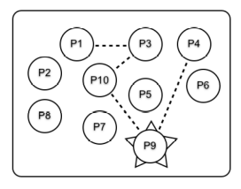
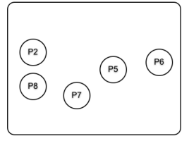
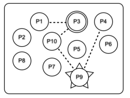
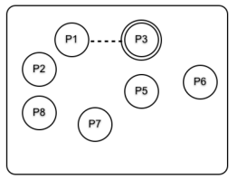

# Recall Processes, Agents, and Servers

## Process - basic process stuff

- spawn - spawns a new process running inidcated code 

- link  - links two processes
  + whichever dies send termination signal to other

- spawn_link - combines the two above in an atomic action

- monitor - monitors one process 
  + monitored process informs monitor when dying

- send - sends message (asynchonous)

- receive - handles message 
  + blocking if no message matching given specs

- exit - send exit signal to process


## Agent - encapsulating state

- start / start_link - starts process 
  + argument function yielding initial state

- get - computes data from state (blocking)
  + argument function takes state and computes value

- update - updates state (blocking)
  + argument function takes state and returns new state

- get_and_update - combines the two above

- cast - updates state (non-blocking)

## GenServer - Server behavior Pattern

### Calls

- start / start_link - starts the server

- call - makes synchronous call to server (blocking)

- cast - makes asynchronous call to server (non-blocking)

- stop - stops the server

### Callbacks

- init - initializes server's state (blocking)

- handle_call - handle synchronous messages

- handle_cast - handle asynchronous messages

- terminate - cleans up before exit

# Distributing Applications

## Associating names to VMs

- `--sname <name>` names the current (Erlang) VM instance
- it can be referred to by this name from other VMs

```
irc$ iex --sname server -S mix
iex(server@desktop)1> ServerSupervisor.start_link()
{:ok, #PID<0.147.0>}
iex(server@desktop)2> Server.register(Server, :server_log)
{:registered, #PID<0.156.0>}
iex(server@desktop)3> ClientThread.init
Received: {:post, :general, "server_log has joined the channel"}
```

## Performing a remote call (`GenServer` style)

`GenServer.call({name, node}, arg)`

: Sends message `arg` to process `name` on `node`

```{.small}
irc$ iex --sname one -S mix
iex(one@desktop)1> {:registered, srv} = GenServer.call(
    {Server, :'server@desktop'}, {:register, :one})
{:registered, #PID<16719.162.0>}
iex(one@desktop)2> ServerThread.post(srv, :general, "Hi!")
:ok
iex(one@desktop)2> flush
{:post, :general, "one has joined the channel"}
{:post, :general, {:one, "Hi!"}}
:ok
iex(one@desktop)3> ServerThread.leave(srv, :general)
:ok
```

## About `GenServer`'s way of identifying processes

Once the server is started, the remaining `GenServer` functions

- call/3, cast/2, and friends

will accept any of the following to refer to the server

- a PID
- an atom if server locally registered (e.g., `Server`)
- `{atom, node}` if server locally registered at another node
  + e.g., `{Server, :'server@desktop'}`
- `{:global, term}` if server globally registered
- `{:via, module, name}` if server registered through an alternative registry


## Distributing among multiple machines

- all machines have a `~/.erlang.cookie` file with exactly the same value.
- `epmd` is running on a port that is not blocked (default `4369`)
  + `epmd` --- Erlang Port Mapper Daemon
  + Acts as a nameserver on a host involved in distributed erlang
- if running over internet, use `--name` with fully qualified name


# Error Handling

## Error Handling: Sequential vs Concurrent Programming [^JoeArmstrong]

[^JoeArmstrong]: Joe Armstrong, Programming Erlang, Second Edition 2013

### Sequential processes

- If process dies we are in deep trouble
  + No other process can help
- Hence, sequential processes focus on:
  + prevention of failure
  + defensive programming

### Concurrent Elixir/Erlang processes

- Remote detection and handling of errors
- Instead of handling error in the process where it occurs
  + let process die
  + correct error in some other process

## Fault tolerant systems design [^JoeArmstrong]

We must assume that:

- Errors will occur
- Processes will crash
- Machines will fail

Therefore:

- Let it crash
- Let some other process fix the error


## Linking

- Processes can be linked using the `Process.link` function.
- Such links a bidirectional
- When one process finishes, it sends a signal to all processes linked to it

![[^JoeArmstrong]](images/supervizare.jpg){ height=30% }

## Linking cascading example [^JoeArmstrong]

{ height=30% }

{ height=30% }

## Linking cascading with P3 trapping exit signals

{ height=30% }

{ height=30% }


## Non-failing, uni-directional links (Monitors)

- Processes can be monitored using the `Process.monitor` function
- Such links are uni-directional
- When the monitored process finishes, it sends a `DOWN` signal to all
processes monitoring it
- The monitoring processes can decide to act (or not) on that message

## The need for a stronger abstraction

- Monitors should restart failing processes
- However, simple restart might not suffice
  + as failing processes might need to be accessible from outside
  + need names for processes
  + need a registry mapping names to current instances of the process


# Supervisors

## What is a Supervisor

A Supervisor is a process _supervising_ other processes

- Provides fault-tolerance
- Encapsulates application start-up / shut-down

### Supervisor duties

- Start the child processes
- Restart them upon failure or certain condition reached
- Orderly terminate them upon system shutdown

## Example: Supervising the server

```elixir
defmodule ServerSupervisor do
  use Supervisor

  def start_link(opts \\ []), do:
    Supervisor.start_link(__MODULE__, :ok, opts)

  @impl true
  def init(:ok) do
    children = [
      {Server, name: :server}
    ]
    Supervisor.init(children, strategy: :one_for_one)
  end
end
```

## Example: Supervising the server test
```elixir
  test "supervisor" do
    {:ok, supervisor} = ServerSupervisor.start_link()
    Server.register(:server, :user)
    assert_receive {:post, :general, "user has joined the channel"}
    pid = Process.whereis(:server)
    Process.exit(pid, :kill)
    Process.sleep(1)
    Server.register(:server, :user)
    assert_receive {:post, :general, "user has joined the channel"}
  end
```

## Init options

### `strategy`

Describes strategy used for restarting

`one_for_one`

: restarts only the failing process

`all_for_one`

: restarts all processes when one fails

`rest_for_one`

: restarts failing process and processes started after it

### `max_restarts`

Number of restarts allowed in a time frame; default 3

### `max_seconds`

Time frame in which `:max_restarts` applies; default 5

### `name`

- A register name for the supervisor process; optional

## Child specifications

`spawn_link/2` or `init/2` receives a list of child specifications

- Either the name of a module to invoke `start_link` on
- Or a tuple of a `module` and options to be passed to `start_link`
- Or a full child specification
  ```elixir
  child_spec() :: %{
    :id => atom() | term(),
    :start => {module(), atom(), [term()]},
    optional(:restart) => :permanent | :transient | :temporary,
    optional(:shutdown) => timeout() | :brutal_kill,
    optional(:type) => :worker | :supervisor,
    optional(:modules) => [module()] | :dynamic
  }
  ```

  - Can be specified as extra arguments to `use GenServer`
